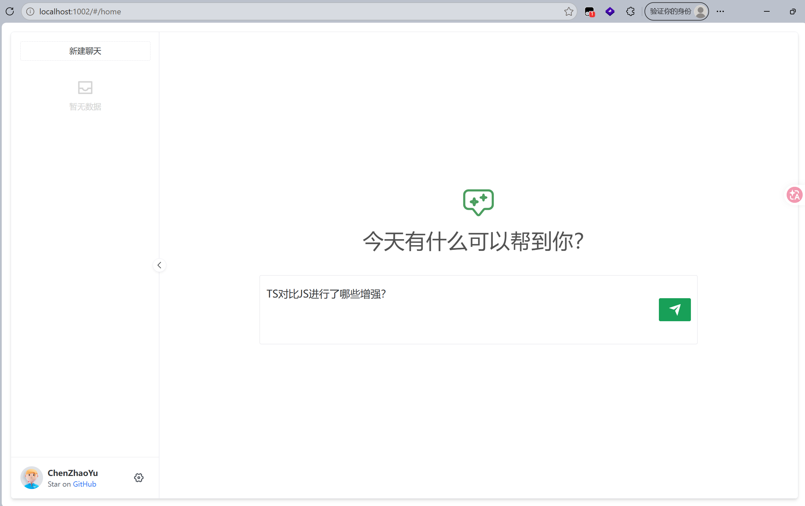
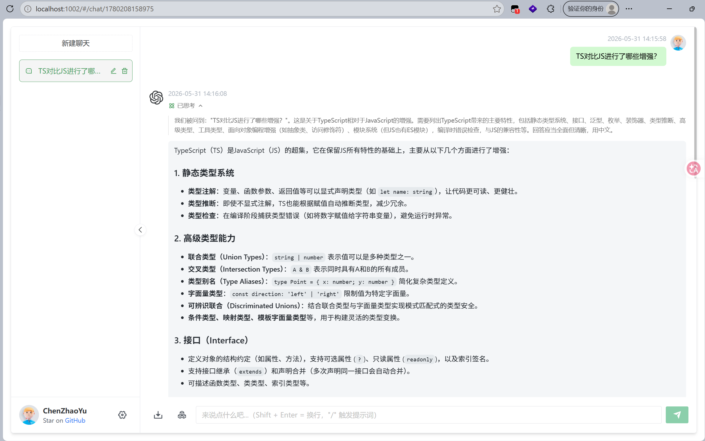
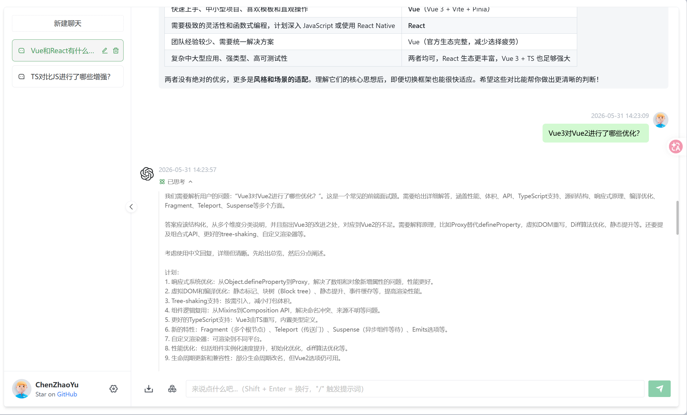
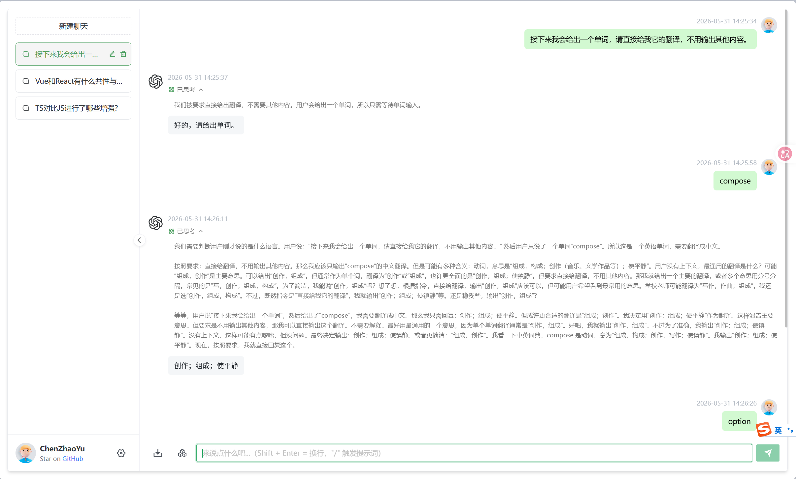
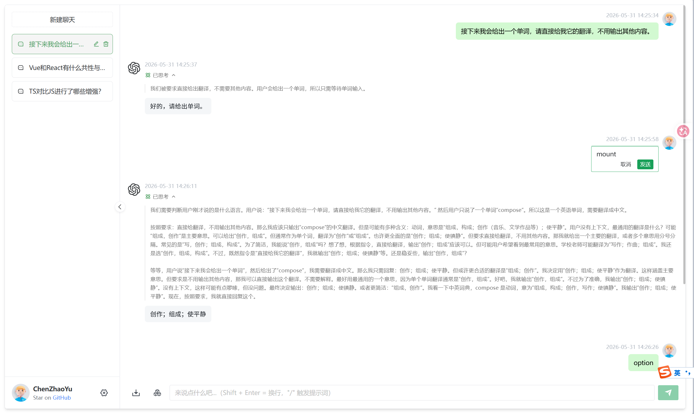
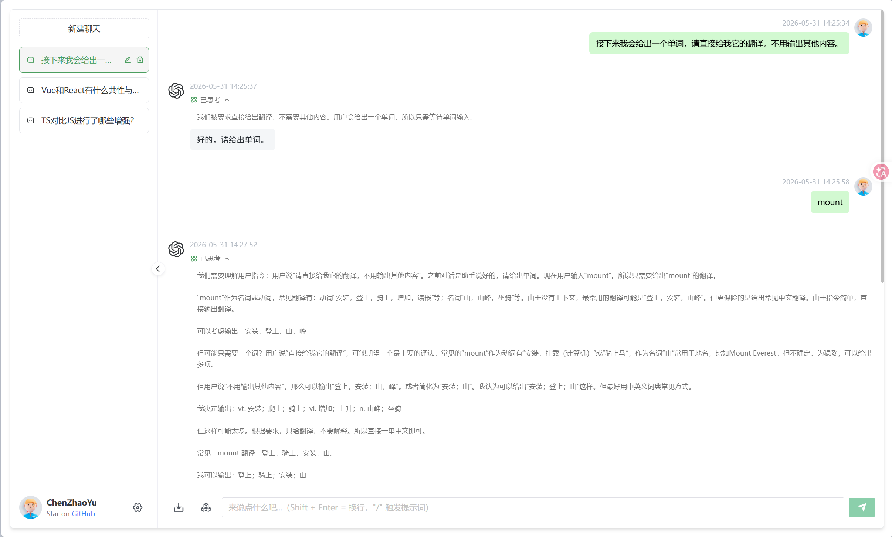

# GPT-Web Lite


## 相对原版的改动

| 方面 | 原版 ChatGPT-Web | GPT-Web Lite |
|------|------------------|--------------|
| 会话存储 | `history` + `chat` 双数组 | `sessions` + `ChatTurn` 单源模型 |
| 后端协议 | `chatgpt` 库 + 自定义流 | OpenAI Chat Completions + SSE |
| 请求体 | `prompt` + `parentMessageId` 等 | 标准 `messages` 数组 |
| 侧栏 | 按索引删除、`History` 类型 | 按 UUID 操作，标题取自首轮 Prompt |
| 编排方式 | 组件内直接改 store | Bubble emit，chat 页统一 `streamTurn` |
| 产品范围 | 上下文开关、会话内清空等 | 精简上述能力，聚焦多轮流式主路径 |

## 技术栈

**前端**：Vue 3 · TypeScript · Vite · Naive UI · Pinia · Vue Router · Axios

**后端**：Express · OpenAI Node SDK · dotenv · express-rate-limit

## 快速开始

### 环境要求

- Node.js `^16 || ^18 || ^20`
- pnpm

### 1. 配置后端

```bash
cd service
cp .env.example .env
```

编辑 `service/.env`，至少填写：

```env
OPENAI_API_KEY=your_api_key
OPENAI_API_BASE_URL=https://api.deepseek.com
OPENAI_API_MODEL=deepseek-v4-pro
```

可选：`AUTH_SECRET_KEY` 开启访问鉴权（前端 Settings 或 `/verify` 接口校验）。

### 2. 安装依赖

```bash
# 后端
cd service && pnpm install

# 前端（项目根目录）
pnpm bootstrap
```

### 3. 启动开发环境

```bash
# 终端 1：后端（端口 3002）
cd service && pnpm dev

# 终端 2：前端
pnpm dev
```

前端默认通过 `/api` 代理访问后端，浏览器打开 Vite 提示的本地地址即可。

## 目录结构

```
chatgpt-web/
├── docs/
│   └── images/                 # README 演示截图
├── src/
│   ├── api/                      # 接口与流式请求入口
│   ├── store/modules/session/    # 会话状态（Session / Turn）
│   ├── utils/stream/             # SSE 解析
│   └── views/chat/               # 对话页、Bubble、ChatComposer 等
└── service/
    └── src/
        ├── index.ts              # Express 路由
        └── oepnai/               # OpenAI 客户端与流式透传
```

## 核心流程

1. 用户在 Home 或 Chat 页输入 Prompt
2. `sessionStore` 写入 Turn，并由 `composeRequest` 组装 OpenAI `messages`
3. 前端 `submitRequestBody` 请求 `/chat-process`，后端 SSE 透传模型分片
4. `appendAssistantDelta` 增量更新正文与思考内容，完成后 `finishTurn` 持久化

## 功能展示

截图位于 [`docs/images/`](./docs/images/)，远程仓库可直接预览。

### Home 起始页

独立欢迎页与输入区，创建会话后自动跳转并发起首轮流式请求。

<p align="center">
  
</p>

### 思考过程与 Markdown 渲染

流式展示 `reasoning_content`（可折叠「已思考」），正文支持 Markdown 与代码块。

<p align="center">
  
</p>


<p align="center">
  
</p>

### 多轮对话

同一会话内多轮上下文连贯，侧栏标题取自首轮 Prompt。

<p align="center">
  
</p>

### 用户消息编辑重发

悬停用户气泡可编辑 Prompt，发送后截断后续上下文并重新流式请求。

<p align="center">
  
</p>

### 多会话管理

侧栏按 UUID 管理会话，支持重命名、删除与切换。

<p align="center">
  
</p>

## 待修复的问题
1.流式输出时仍然可以点击重试按钮或者更改Prompt。
2.未对请求失败的边界情况进行处理和自动重试
3.缺少思考时的样式
4.缺少测试和代码审查
5.只支持文本这种单一模态
6.未对原版的性能进行测试与优化等
7.助手的头像部分应该根据模型更改
## 后续增强计划

按优先级排列，供二期及以后迭代参考。

### 近期（低成本、高收益）

- [ ] **JSON 导入 / 导出**：全量或单会话备份，带 schema 版本号，便于迁移与恢复
- [ ] **输入框体验**：长文本 autosize 优化、Home / Chat 输入组件进一步统一
- [ ] **停止生成状态**：Abort 后标记「已停止」，避免半句回复语义不清
- [ ] **清理遗留代码**：移除已注释的 chatgpt 库逻辑与无效 UI 入口
### 中期（架构增强）

- [ ] **按会话维度的 streaming 状态**：`Map<uuid, AbortController>`，支持 A 会话生成时 B 会话仍可对话
- [ ] **设置页数据管理**：备份、恢复、清空入口集中
- [ ] **上下文策略可配置**：`composeRequest` 支持「仅当前轮 / 完整历史」等模式
- [ ] **错误与重试 UX**：网络失败、鉴权失效等统一提示与恢复引导

### 远期（按需）

- [ ] **文件 / 图片上传**：扩展 Turn 附件字段，多模态 `messages` 组装与上传接口
- [ ] **服务端持久化**：SQLite / PostgreSQL + 简易账号体系，localStorage 作离线缓存
- [ ] **导出 Markdown / PDF**：除现有截图导出外的文本格式导出

## 说明

- 本项目仅供学习与交流，请自行配置 API Key，**勿将密钥提交至公开仓库**
- 当前为**单会话单飞**（同一会话同时仅一条流式请求），与多数 AI 产品一致
- 基于原项目 [MIT License](https://github.com/Chanzhaoyu/chatgpt-web/blob/main/license) 二次开发，感谢 [ChenZhaoYu](https://github.com/Chanzhaoyu) 的开源工作

## License

MIT
